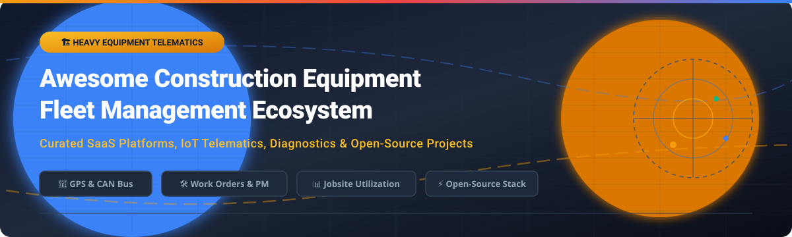

# 🏗️ Awesome Construction Equipment Fleet Management 🚜

  

## 📌 Top Equipment Fleet Management (Construction) Platforms Ecosystem

**Curated List of Construction Fleet Management SaaS Products & Open-Source Telematics GitHub Projects**  
*Focused on Construction Equipment Tracking, Preventive Maintenance Management, CAN Bus & OBD-II Telematics, Jobsite Utilization & Asset Tracking*  

**Last updated: September 2026**

This repository tracks top-tier **SaaS platforms** and **open-source projects** for **Equipment Fleet Management in Construction**. These tools help heavy civil contractors, construction companies, heavy equipment operators, rental companies, and field service teams track machinery location, schedule preventive maintenance, manage parts inventory, monitor engine diagnostics, and optimize mixed-fleet operating costs across jobsites.

---

## 📑 Table of Contents

- [📊 Market Overview & Industry Dynamics](#-market-overview--industry-dynamics)
- [🏢 SaaS/Hosted Platforms](#-saashosted-platforms)
- [💻 Open-Source GitHub Projects](#-open-source-github-projects)
- [🤝 Support & Community](#-support--community)
- [📈 Star History](#-star-history)
- [🤝 How to Contribute](#-how-to-contribute)
- [⚠️ Disclaimer](#%EF%B8%8F-disclaimer)

---

## 📊 Market Overview & Industry Dynamics

> **Market Size & Structure**: The global construction equipment fleet management and telematics market size is estimated at **\$9.2 Billion in 2026** and projected to reach **\$16.8 Billion by 2031** (CAGR of ~12.7%).
> 
> **Industry Fragmentation**: The market is **highly fragmented**. While large public enterprise players (such as Caterpillar VisionLink and Samsara) command significant market share in enterprise mixed fleet telemetry, hundreds of specialized regional vendors, OEM-integrated software solutions, and niche equipment tracking providers split the remaining market. No single vendor holds a dominant "winner-take-all" monopoly.

---

## 🏢 SaaS/Hosted Platforms

Below is a curated comparison of leading SaaS solutions for heavy equipment fleet management, ordered by **Company Scale (Revenue / Valuation)** descending:

| 🏢 Platform | 💰 Starting Pricing | 🎁 Free Tier / Trial Limits | 📈 Scale (Rev / Valuation) | 📝 Description |
| :--- | :--- | :--- | :--- | :--- |
| **[Caterpillar VisionLink](https://www.cat.com/)** | \$15/asset/month (Basic Telematics) | 30-Day Free Trial (up to 5 assets) | **\$67.1B Rev / \$170B Val** (Caterpillar Inc.) | Caterpillar's flagship equipment management software providing real-time machine payload, fuel burn, fault codes, and utilization analytics across Cat and AEMP 2.0 mixed fleets. |
| **[Trimble Fleet](https://www.trimble.com/)** | \$22/vehicle/month (Core Telematics) | 14-Day Request Demo / Trial | **\$3.8B Rev / \$15.2B Val** | Comprehensive construction telematics platform integrated with Trimble Connected Site for machine control, grade control, and heavy civil fleet dispatching. |
| **[Samsara Equipment](https://www.samsara.com/)** | \$33/asset/month (Annual Contract) | 30-Day Free Hardware Trial | **\$1.8B Rev / \$22.5B Val** | AI-powered Connected Operations Cloud offering equipment GPS tracking, engine diagnostics, driver safety dashcams, and automated maintenance alerts. |
| **[Geotab Construction](https://www.geotab.com/)** | \$18/device/month (Base Plan) | 30-Day Pilot Program | **\$650M Rev / \$2.5B Val** | Scalable telematics and OBD-II/J1939 engine diagnostic platform tailored for mixed construction fleets, electric equipment, and asset tracking. |
| **[EquipmentShare](https://www.equipmentshare.com/)** | \$25/asset/month (T3 Telematics OS) | Free 14-Day T3 System Demo | **\$3.2B Rev / \$4.5B Val** | Construction technology & rental ecosystem powered by T3 OS for contractor asset tracking, remote equipment lockout, and digital work orders. |
| **[Teletrac Navman](https://www.teletracnavman.com/)** | \$20/vehicle/month (Director Lite) | 14-Day Guided Trial | **\$250M Rev / \$1.2B Val** (Vontier Corp) | Construction fleet telematics solution offering GPS tracking, jobsite geofencing, driver scorecarding, and fuel compliance reporting. |
| **[Trackunit](https://trackunit.com/)** | \$19/machine/month (Raw Connect) | 30-Day Free Trial (Select OEM Hardware) | **\$185M Rev / \$1.1B Val** | Specialist telematics provider for heavy machinery and rental fleets, featuring Bluetooth asset tags, machine utilization, and ISO 15143-3 (AEMP 2.0) data feeds. |
| **[HCSS Equipment360](https://www.hcss.com/)** | \$45/user/month (Base License) | 14-Day Customized Demo | **\$140M Rev / \$850M Val** | Heavy civil construction equipment maintenance software with digital work orders, mechanic scheduling, and parts inventory management integrated with HeavyBid. |
| **[Fleetio Construction](https://www.fleetio.com/)** | \$5/vehicle/month (Starter Plan) | 14-Day Free Trial (No Credit Card) | **\$45M Rev / \$350M Val** | Modern cloud fleet maintenance software featuring work order management, DVIR inspections, fuel card integrations, and automated preventive maintenance schedules. |
| **[Tenna](https://www.tenna.com/)** | \$12/asset/month (Tracker Plan) | 14-Day Free Operational Demo | **\$25M Rev / \$150M Val** | Construction-only equipment management platform providing mixed-fleet tracking (heavy machinery, vehicles, mid-sized equipment, and small tools). |

---

## 💻 Open-Source GitHub Projects

The open-source ecosystem offers powerful options for self-hosting telematics servers, CAN bus decoding engines, logistics dispatching, and equipment maintenance modules. Projects are sorted by **GitHub Star Count** descending:

| 📦 Repository | ⭐️ Star Count | 🛠️ Tech Stack & License | 🚀 Primary Focus |
| :--- | :--- | :--- | :--- |
| **[Traccar](https://github.com/traccar/traccar)** |  | Java, React, MySQL/PostgreSQL (Apache-2.0) | Leading open-source GPS tracking system supporting **200+ telemetry protocols** and 2,000+ device models. Supports geofencing, speed alerts, and custom alarms. |
| **[OpenRemote](https://github.com/openremote/openremote)** |  | Java, TypeScript, PostgreSQL (AGPL-3.0) | 100% open-source IoT Platform with dedicated fleet management and asset tracking modules for large-scale equipment monitoring. |
| **[Fleetbase](https://github.com/fleetbase/fleetbase)** |  | PHP/Laravel, Ember.js, Docker (AGPL-3.0) | Open-source logistics and supply chain operating system. The **Fleet-Ops** module provides real-time tracking, order dispatching, and route optimization. |
| **[MyCarTracks API / Client](https://github.com/mycartracks/android-tracker)** |  | Java, Android SDK (MIT) | Open-source mobile tracker client for recording construction vehicle drives, automatic jobsite entrance/exit detection, and geofence logs. |
| **[Loxya](https://github.com/Loxya/Loxya)** |  | PHP, Vue.js, Docker (AGPL-3.0) | Open-source equipment rental management platform to manage heavy machinery inventory, client contracts, reservations, and dispatching. |
| **[CarCare Server](https://github.com/kacperkasztelanic/carcare-server)** |  | Java (Spring Boot), React, MariaDB (MIT) | Vehicle and machinery fleet management backend tracking repairs, maintenance, inspections, insurance renewals, and fuel logs. |
| **[Fleetms](https://github.com/jmnda-dev/fleetms)** |  | Elixir (Phoenix), Tailwind CSS, PostgreSQL (MIT) | Open-source Fleet Maintenance Management System (FMMS) with DVIR checklists, work orders, service reminders, and parts inventory. |
| **[Routario](https://github.com/bkbillybk/routario)** |  | Python 3.11+, FastAPI, PostgreSQL/PostGIS (GPL-3.0) | Self-hosted GPS fleet tracking server with 8 native protocols (Teltonika, Queclink, TK103) featuring live map, geofencing, and zero subscription fees. |
| **[Track Maintenance](https://github.com/Marvinjon/track-maintenance)** |  | Python (FastAPI), React 18, MySQL (Apache-2.0) | Open-source companion service for **Traccar** adding maintenance logs, spare parts inventory, and automated service reminders via REST webhooks. |
| **[Fleet Management System](https://github.com/pypi/fleet-management-system)** |  | Python, SQLite/PostgreSQL (MIT) | Python automotive & equipment telematics engine supporting OBD-II diagnostics, NMEA 0183 GPS, CAN bus decoding, and DTC code analysis. |

---

## ☕ Support & Community

If you find this curated ecosystem list helpful for your construction tech stack or open-source research, please consider supporting the project!

- ⭐️ **Star this repository** to help others discover construction telematics tools.
- 🔀 **Fork it** to contribute new SaaS platforms or open-source projects.
- 📢 **Share** with fleet managers, civil engineers, and IoT developers.
- 💖 **Sponsor the Maintainer**: Buy me a coffee via [GitHub Sponsors](https://github.com/sponsors/ishandutta2007).

---

## 📈 Star History

---

## 🤝 How to Contribute

1. Fork the repository.
2. Add or edit entries in `README.md` maintaining table formatting.
3. Ensure pricing, valuation, and GitHub star links are up-to-date and accurate.
4. Submit a Pull Request with a short description of the changes.

---

## ⚠️ Disclaimer

- This is a **community-curated** list — not exhaustive and not an endorsement of any particular SaaS or software product.
- Construction equipment fleet management software handles critical machinery diagnostics and jobsite safety data; always ensure compliance with local regulations and ISO telematics standards (such as AEMP 2.0 / ISO 15143-3).

---

**Made for construction fleet managers, civil contractors, equipment operators, and IoT telematics developers.**
